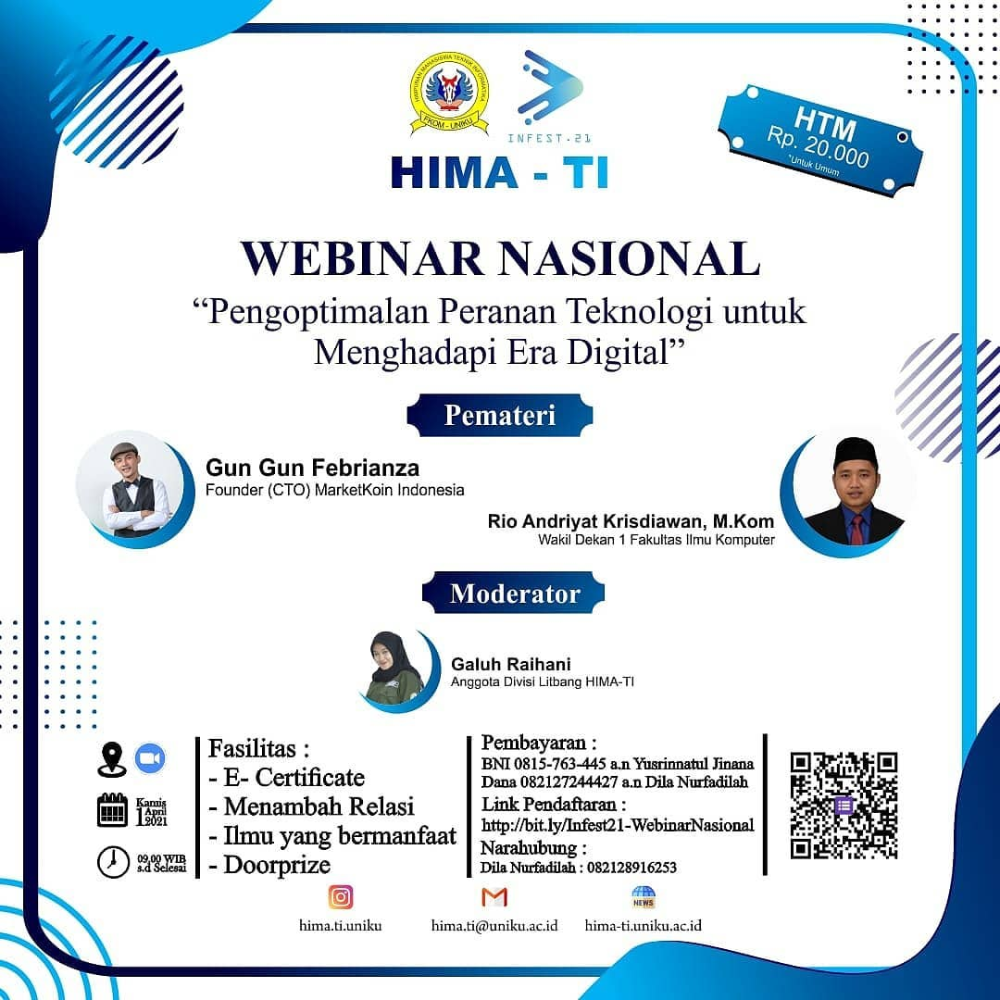
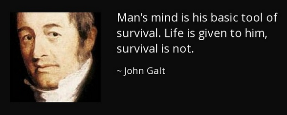

# Optimization The Role of Technology

# Technology

Jika kita lihat judul webinar ini, ada dua terminologi yang harus kita fahami terlebih dahulu yaitu technology dan Digital Era. Kita akan memulai membahasnya dari technology terlebih dahulu. So what is technology? 

Technology is just a tools.

Technology melahirkan sebuah paradox, technology bisa digunakan untuk membantu manusia dan bisa digunakan untuk merugikan manusia. Seperti yang telah di bahas oleh Marx dalam bukunya yang berjudul das kapital, pada bab 15 tentang "Machinery and Modern Industry"

Technologi dianggap sebagai instrument yang dapat dikendalikan oleh kapitalis untuk meningkatkan profit pendapatan mereka dengan cara mengorbankan tenaga kerja manusia. Kemajuan teknologi dapat menimbulkan sulitnya lapangan pekerjaan dan pengangguran.

Kita tahu bahwa technology adalah sebuah tools, agar kita bisa memberikan manfaat yang lebih banyak saat menggunakan teknologi kita memerlukan pikiran (mind). Pikiran sebagai alat dasar (basic tools) agar anak adam bisa survive.

*Man's Mind is the basic tools*, seperti yang telah di jelaskan oleh John Galt.

Jadi ada dua tools ya, tools pertama sebagai tools dasar adalah pikiran dan kedua adalah technology. Untuk bisa menggunakan pikiran dan teknologi dengan baik kita memerlukan sebuah design thinking. 

Design Thinking adalah sebuah metodologi berpikir kreatif yang bisa kita gunakan untuk memecahkan masalah.

Masalah yang bisa kita pecahkan, bisa dimulai dengan mencoba memecahkan masalah-masalah kita sendiri. Jika kita sudah bisa memecahkan masalah-masalah kita sendiri, masalah orang lain atau sebagian besar orang maka kita adalah salah satu orang yang sukses.

Dalam konteks bisnis, kesuksesan kita dalam berbisnis ditandai dengan terpenuhinya ***Customer Need***. Kita memecahkan masalah-masalah yang sedang dihadapi customer. Adanya transaksi antara customer dengan bisnis yang sedang kita jalani, kedua belah pihak mendapatkan keuntungan dari kegiatan transaksi.

# Digital Era Challenge

Digital Era adalah saat binary digit yang terdiri dari angka 0 dan 1 (biner) menjadi fondasi untuk melakukan komputasi. Komputer mulai berperan sebagai teknologi yang mampu menyelesaikan berbagai permasalahan industri. Untuk itu kita perlu melihat lagi runutan revolusi industri.

Era digital, atau revolusi digital diawali pada Revolusi Industri ke 3 saat komputer dan internet sudah mulai menjadi bagian dan kebutuhan hidup  manusia. Hadirnya industri semikonduktor, mainframe computing dan personal computing  melahirkan super creative destruction dan suburnya perkembangan inovasi. 

Pada revolusi industri ketiga ditandai dengan penggunakan perangkat elektronik untuk mengurangi pekerja. Penggunaan **PLC** (**Programmer Logic Controller**) sebuah komputer digital yang dapat diprogram dan didesain memiliki  ketahanan baik dilingkungan yang ekstrim sehingga cocok untuk **manufacturing** di berbagai **industry**.

Era digital yang kita hadapi saat ini adalah era digital yang sudah melalui berbagai fase.

Akhirnya kita sampai pada gambaran besar kita, tentang bagaimana cara menghadapi tantangan di era digital saat ini. 

Tantangan dari Digital Era adalah bisa dibaca mulai dari konsep digitalization

Contoh Digitalization di sektor Financial Technology & Blockchain :

# Digital Transformation

Era digital melahirkan sebuah konsep yang dikenal dengan Digital Transformation, sebuah fenomena yang memberikan perubahan besar untuk sisi sosial dan ekonomi. Tersedianya ruang dan channel untuk melakukan networking antar berbagai aktor untuk bertukar data melahirkan tatanan baru.

